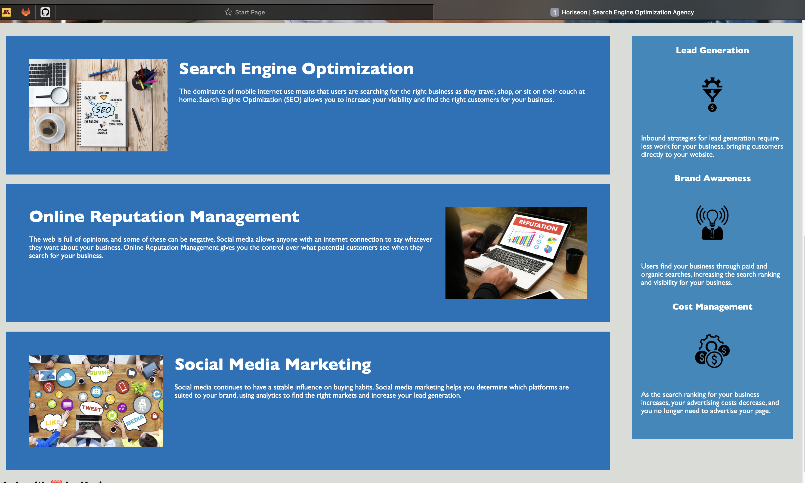

# Horiseon Challenge
# Description
Module Challenge: A marketing agency wants their existing website to be more accessible. In this challenge, I am assigned to refactor the given webpage so that it follows accessibility standards and is optimized for search engines.
# Acceptance Challenge
- Source code contains proper use of semantic HTML elements
- Elements adhere to a logical structure independently of styling and positioning
- Image elements include accessible alt attributes
- Heading elements fall in sequential order
- Title element is concise and descriptive
# Screenshot

# Deployed Webpage URL
[webpage link](http://127.0.0.1:5500)
# Github Repository URL
[Horiseon Challenge](https://github.com/00Veronica/Horiseon.git)